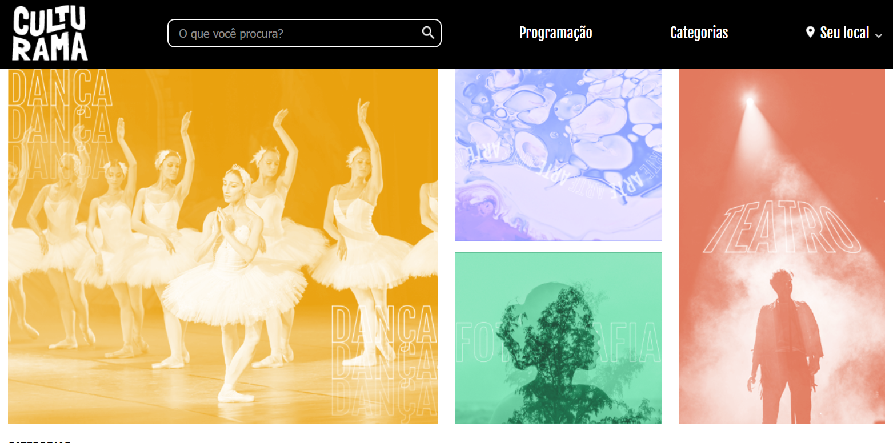
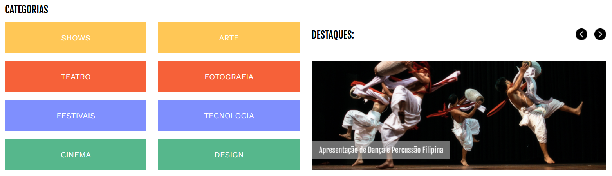
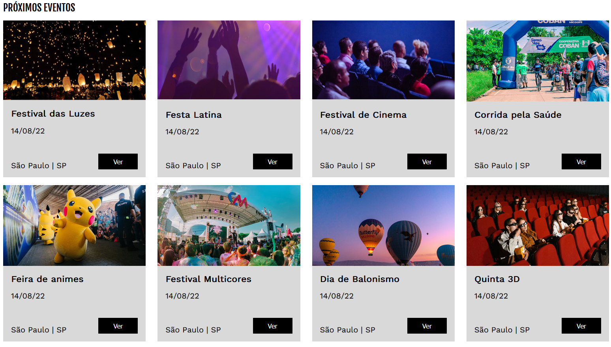

## 🎭 Culturama

O **Culturama** é uma página responsiva desenvolvida com **CSS Grid** e **Flexbox**, seguindo a abordagem **mobile-first**. A aplicação simula um portal cultural com um banner inicial, seções de categorias, destaques e eventos, organizadas com precisão utilizando áreas de grid e alinhamentos flexíveis.

 

## 🚀 Sobre o Projeto

Este projeto foi desenvolvido durante o curso da Alura:

* "Praticando CSS: Grid e Flexbox"

O foco do curso é aplicar conceitos fundamentais de **layout responsivo**, utilizando **Flexbox para alinhamentos e espaçamentos, e Grid Layout para estruturação de áreas**, de forma a criar uma página bem organizada, moderna e adaptável a diferentes tamanhos de tela.

## 📚 Objetivos do Curso

* Construir um projeto responsivo praticando com **Flexbox e Grid**, com base no **mobile-first**;
* Calcular a largura das colunas e altura das linhas de um **Grid Layout**;
* Entender **alteração de eixos** com Flexbox;
* Desenhar templates por meio das **áreas do Grid**;
* Criar **alinhamentos e espaçamentos** com Flexbox e Grid.

## 🛠️ Tecnologias Utilizadas

## 🖼️ Visualização do Projeto

Uma prévia das principais funcionalidades do **Culturama**:

**🌐 Acesse o Projeto Online**

O projeto está disponível para visualização na **Vercel**. Clique no link abaixo para acessar:

**🎨 Banner Inicial**

Imagem inicial do Culturama.

**🗂️ Categorias e Destaques**

Layout dividido com categorias de um lado e os eventos em destaque do outro.

**📅 Eventos**

Seção com cards de eventos culturais.

